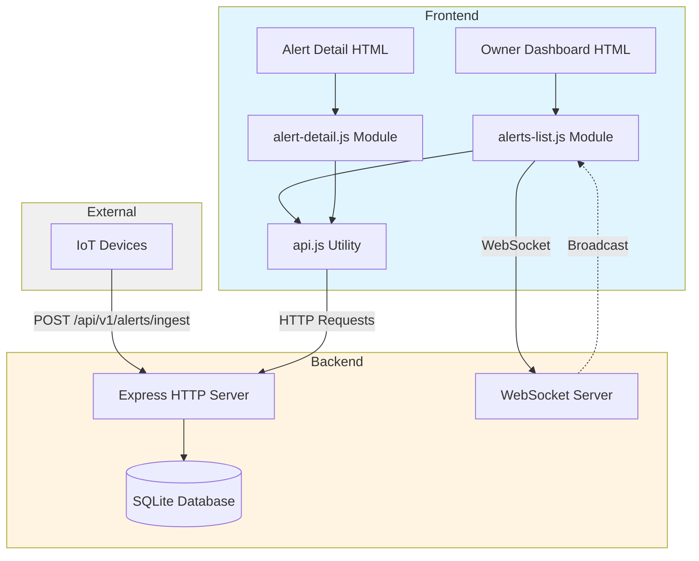

# Design Document

## Overview

The Alert Monitoring System is a full-stack application consisting of a Node.js/Express backend with SQLite persistence, WebSocket server for real-time updates, and frontend JavaScript modules that integrate with existing HTML pages. The system enables IoT devices to ingest alerts, property owners to view and manage alerts in real-time, and maintains a complete audit trail of all alert lifecycle events.

### Key Design Principles

- **Real-time First**: WebSocket connections ensure sub-second update propagation to all connected clients
- **Minimal Frontend Footprint**: JavaScript modules integrate with existing HTML structure without requiring framework rewrites
- **Persistent State**: SQLite with WAL mode provides ACID guarantees and crash recovery
- **Audit Trail**: Every alert action is recorded in history for compliance and debugging
- **Separation of Concerns**: Backend handles business logic and persistence; frontend handles presentation and user interaction

## Architecture

### System Components



### Technology Stack

**Backend:**
- Node.js with Express 4.19.2 for HTTP API
- better-sqlite3 9.6.0 for synchronous database operations
- ws 8.18.0 for WebSocket server
- nanoid 4.0.2 for unique ID generation
- cors 2.8.5 for cross-origin resource sharing

**Frontend:**
- ES6 modules (type="module") for code organization
- Native Fetch API for HTTP requests
- Native WebSocket API for real-time updates
- Vite for development server and module resolution

**Database:**
- SQLite 3 with WAL (Write-Ahead Logging) mode
- Two tables: `alerts` and `alert_history`

### Deployment Model

- Backend runs on port 5174 (configurable via PORT environment variable)
- Frontend served by Vite dev server on port 5173 (development)
- WebSocket endpoint at `ws://localhost:5174/ws`
- CORS enabled for cross-origin requests during development

## Components and Interfaces

### Backend Components

#### 1. Express HTTP Server

**Responsibilities:**
- Handle REST API requests for alert operations
- Validate request parameters
- Execute database operations
- Trigger WebSocket broadcasts
- Return JSON responses

**Endpoints:**

| Method | Path | Purpose | Request Body | Response |
|--------|------|---------|--------------|----------|
| POST | /api/v1/alerts/ingest | Create new alert | `{tenant_id, house_id, device_id, type, message}` | `{id, severity, status}` |
| POST | /api/v1/alerts/search | Query alerts | `{severity?, status?, type?, since?, limit?}` | `{items: Alert[]}` |
| GET | /api/v1/alerts/:id | Get alert details | - | `{alert: Alert, history: History[]}` |
| POST | /api/v1/alerts/:id/ack | Acknowledge alert | `{actor}` | `{status}` |
| POST | /api/v1/alerts/:id/resolve | Resolve alert | `{actor}` | `{status}` |

#### 2. WebSocket Server

**Responsibilities:**
- Accept WebSocket connections at `/ws` path
- Send welcome message on connection
- Broadcast alert events to all connected clients
- Handle client disconnections gracefully

**Message Format:**
```json
{
  "type": "alert.created" | "alert.updated" | "hello",
  "payload": Alert | "connected"
}
```

**Connection Lifecycle:**
1. Client connects to `ws://localhost:5174/ws`
2. Server sends `{"type": "hello", "payload": "connected"}`
3. Server broadcasts alert events as they occur
4. Client maintains connection for duration of session

#### 3. Database Layer

**Schema:**

```sql
CREATE TABLE alerts (
  id TEXT PRIMARY KEY,
  tenant_id TEXT,
  house_id TEXT,
  device_id TEXT,
  type TEXT,
  severity TEXT,
  status TEXT,
  message TEXT,
  ts TEXT,
  acknowledged_by TEXT,
  acknowledged_at TEXT,
  resolved_by TEXT,
  resolved_at TEXT
);

CREATE TABLE alert_history (
  id TEXT PRIMARY KEY,
  alert_id TEXT,
  action TEXT,
  actor TEXT,
  note TEXT,
  ts TEXT
);
```

**Prepared Statements:**
- `insertAlert`: Insert new alert record
- `updateAck`: Update alert to acknowledged status
- `updateResolve`: Update alert to resolved status
- `selectAlert`: Retrieve single alert by ID
- `insertHistory`: Insert history entry

**Design Decisions:**
- TEXT type for timestamps (ISO 8601 format) for portability
- No foreign key constraints for simplicity (referential integrity maintained by application)
- WAL mode for better concurrent read performance
- Synchronous API (better-sqlite3) for simpler error handling

#### 4. Severity Rules Engine

**Implementation:**
```javascript
const RULES = {
  glass_break: 'high',
  smoke_alarm: 'critical',
  dog_bark: 'low'
};
```

**Logic:**
- Lookup alert type in RULES map
- Default to 'low' severity if type not found
- Applied during alert ingestion

**Extensibility:**
- Add new rules by extending RULES object
- Consider moving to database table for dynamic configuration in future

### Frontend Components

#### 1. API Utility Module (`assets/js/api.js`)

**Responsibilities:**
- Provide reusable HTTP request functions
- Handle API base URL configuration
- Centralize error handling
- Abstract fetch API details

**Interface:**
```javascript
export const API_BASE: string;
export async function post(path: string, body?: object): Promise<any>;
export async function get(path: string): Promise<any>;
```

**Design Decisions:**
- Detect localhost to use development API URL
- Throw errors for non-2xx responses
- Always send/expect JSON content type

#### 2. Alerts List Module (`assets/js/alerts-list.js`)

**Responsibilities:**
- Load and display alerts table
- Handle WebSocket connection for live updates
- Manage alert generator buttons
- Implement status filtering
- Update alert count display

**Key Functions:**
- `rowHtml(alert)`: Generate table row HTML for an alert
- `upsertRow(alert)`: Insert new row or update existing row
- `load()`: Initial data fetch and table population

**WebSocket Integration:**
- Connect on module load
- Listen for `alert.created` and `alert.updated` messages
- Call `upsertRow()` to update UI without full refresh

**Event Handlers:**
- Generator buttons: POST to `/api/v1/alerts/ingest`
- Status filter: POST to `/api/v1/alerts/search` with filter params

#### 3. Alert Detail Module (`assets/js/alert-detail.js`)

**Responsibilities:**
- Extract alert ID from URL query parameter
- Fetch and display alert metadata
- Fetch and display alert history
- Handle acknowledge and resolve actions
- Refresh display after actions

**Key Functions:**
- `refresh()`: Fetch alert and history, update DOM
- Event handlers for acknowledge/resolve buttons

**URL Parameter Handling:**
```javascript
const params = new URLSearchParams(location.search);
const id = params.get('id');
```

### Integration with Existing Pages

#### Owner Dashboard Integration

**Modifications Required:**
1. Add alerts table structure to "Live Alerts" or "Dashboard" section
2. Add generator buttons for testing
3. Add status filter dropdown
4. Include `<script type="module" src="assets/js/alerts-list.js"></script>`

**HTML Structure:**
```html
<section>
  <h2>Alerts <small>(<span id="alerts-count">0</span>)</small></h2>
  
  <div class="toolbar">
    <button id="gen-glass">Generate Glass Break</button>
    <button id="gen-smoke">Generate Smoke Alarm</button>
    <button id="gen-dog">Generate Dog Bark</button>
    
    <label>Status:
      <select id="filter-status">
        <option value="">All</option>
        <option>open</option>
        <option>acknowledged</option>
        <option>resolved</option>
      </select>
    </label>
  </div>
  
  <table class="table">
    <thead>
      <tr><th>Time</th><th>Type</th><th>House</th><th>Severity</th><th>Status</th><th></th></tr>
    </thead>
    <tbody id="alerts-tbody"></tbody>
  </table>
</section>
```

**CSS Requirements:**
- `.pill` class for severity/status badges
- `.pill-low`, `.pill-high`, `.pill-critical` for severity colors
- `.pill-open`, `.pill-acknowledged`, `.pill-resolved` for status colors
- `.toolbar` for button/filter layout

#### Alert Detail Page Integration

**Modifications Required:**
1. Replace static content with dynamic containers
2. Add acknowledge/resolve buttons
3. Add back link to dashboard
4. Include `<script type="module" src="assets/js/alert-detail.js"></script>`

**HTML Structure:**
```html
<section>
  <h2>Alert Detail</h2>
  <div id="alert-meta" class="card"></div>
  
  <div class="actions">
    <button id="btn-ack">Acknowledge</button>
    <button id="btn-resolve">Resolve</button>
    <a href="owner-dashboard.html">← Back to list</a>
  </div>
  
  <h3>History</h3>
  <ul id="alert-history"></ul>
</section>
```

## Data Models

### Alert Model

```typescript
interface Alert {
  id: string;                    // nanoid generated
  tenant_id: string;             // Multi-tenancy support
  house_id: string;              // Property identifier
  device_id: string;             // IoT device identifier
  type: string;                  // Alert type (glass_break, smoke_alarm, etc.)
  severity: 'low' | 'high' | 'critical';
  status: 'open' | 'acknowledged' | 'resolved';
  message: string;               // Human-readable description
  ts: string;                    // ISO 8601 timestamp
  acknowledged_by?: string;      // Actor who acknowledged
  acknowledged_at?: string;      // ISO 8601 timestamp
  resolved_by?: string;          // Actor who resolved
  resolved_at?: string;          // ISO 8601 timestamp
}
```

**Lifecycle States:**
1. `open`: Initial state when alert is created
2. `acknowledged`: Owner has seen and is addressing the alert
3. `resolved`: Issue has been resolved

**State Transitions:**
- `open` → `acknowledged` (via POST /api/v1/alerts/:id/ack)
- `open` → `resolved` (via POST /api/v1/alerts/:id/resolve)
- `acknowledged` → `resolved` (via POST /api/v1/alerts/:id/resolve)

### History Model

```typescript
interface History {
  id: string;                    // nanoid generated
  alert_id: string;              // Foreign key to alerts.id
  action: string;                // Action type (created, ack, resolve, notify)
  actor: string;                 // Who performed the action (user or 'system')
  note: string;                  // Optional additional context
  ts: string;                    // ISO 8601 timestamp
}
```

**Action Types:**
- `created`: Alert was ingested
- `notify`: Notification was sent (logged for demo)
- `ack`: Alert was acknowledged
- `resolve`: Alert was resolved

### WebSocket Message Model

```typescript
interface WebSocketMessage {
  type: 'alert.created' | 'alert.updated' | 'hello';
  payload: Alert | string;
}
```

## Error Handling

### Backend Error Handling

**Validation Errors (400):**
- Missing required `type` parameter in ingest endpoint
- Return JSON: `{"error": "type required"}`

**Not Found Errors (404):**
- Alert ID does not exist in GET /api/v1/alerts/:id
- Return JSON: `{"error": "not found"}`

**Database Errors:**
- Caught by try-catch in route handlers (if added)
- Log to console
- Return 500 with generic error message

**WebSocket Errors:**
- Client disconnections handled gracefully
- Check `ws.readyState === 1` before sending
- No error thrown if client disconnected

### Frontend Error Handling

**HTTP Errors:**
- `api.js` throws Error with response text
- Calling code should catch and display to user
- Consider adding toast notifications for user feedback

**WebSocket Errors:**
- Connection failures: Log to console, continue with HTTP-only mode
- Message parse errors: Log and ignore malformed messages
- Reconnection: Not implemented (page refresh required)

**Missing DOM Elements:**
- Use optional chaining: `document.querySelector('#id')?.addEventListener(...)`
- Prevents errors when script runs on pages without expected elements

## Testing Strategy

### Backend Testing

**Unit Tests:**
- Test severity rules engine with various alert types
- Test prepared statement execution with mock data
- Test timestamp generation (nowISO function)

**Integration Tests:**
- Test full request/response cycle for each endpoint
- Verify database state after operations
- Test WebSocket broadcast functionality
- Test CORS headers

**Test Data:**
- Create test database file separate from production
- Seed with known alert and history records
- Clean up after each test

**Tools:**
- Jest or Mocha for test runner
- Supertest for HTTP endpoint testing
- ws library for WebSocket client testing

### Frontend Testing

**Unit Tests:**
- Test `rowHtml()` function output
- Test `upsertRow()` DOM manipulation
- Test API utility functions with mocked fetch

**Integration Tests:**
- Test WebSocket message handling
- Test button click handlers
- Test filter functionality
- Test URL parameter extraction

**Manual Testing:**
- Open owner-dashboard.html in browser
- Click generator buttons, verify alerts appear
- Verify WebSocket updates without refresh
- Test status filter
- Navigate to alert detail page
- Test acknowledge/resolve buttons
- Verify history updates

**Tools:**
- Jest with jsdom for DOM testing
- Manual browser testing during development
- Consider Playwright for E2E tests in future

### Test Scenarios

**Scenario 1: Alert Ingestion**
1. POST to /api/v1/alerts/ingest with valid data
2. Verify 200 response with alert ID
3. Verify alert exists in database
4. Verify history entry created
5. Verify WebSocket broadcast sent

**Scenario 2: Real-time Update**
1. Open owner dashboard in browser
2. Verify WebSocket connection established
3. Generate alert via button click
4. Verify new row appears in table without refresh
5. Verify alert count increments

**Scenario 3: Alert Lifecycle**
1. Create alert via ingest endpoint
2. Navigate to alert detail page
3. Click acknowledge button
4. Verify status changes to "acknowledged"
5. Verify history entry added
6. Click resolve button
7. Verify status changes to "resolved"
8. Verify history entry added

**Scenario 4: Filtering**
1. Create alerts with different statuses
2. Select "open" filter
3. Verify only open alerts displayed
4. Verify count reflects filtered results

## Security Considerations

**Current Implementation (Development):**
- No authentication or authorization
- CORS enabled for all origins
- Actor name passed in request body (not verified)
- Database file stored locally without encryption

**Production Recommendations:**
- Add JWT-based authentication
- Implement role-based access control (RBAC)
- Validate tenant_id against authenticated user
- Use environment variables for sensitive configuration
- Enable HTTPS/WSS for encrypted transport
- Implement rate limiting on ingest endpoint
- Add input sanitization for SQL injection prevention
- Encrypt database file at rest
- Implement audit logging for compliance

## Performance Considerations

**Database:**
- WAL mode enables concurrent reads during writes
- Prepared statements reduce parsing overhead
- Consider adding indexes on frequently queried columns (status, ts, tenant_id)
- Monitor database file size, implement archival strategy for old alerts

**WebSocket:**
- Broadcast only to clients with open connections (readyState check)
- Consider implementing rooms/channels for multi-tenant isolation
- Monitor connection count, implement connection limits if needed

**Frontend:**
- Limit initial alert load to 100 items
- Implement pagination for large result sets
- Debounce filter changes to reduce API calls
- Consider virtual scrolling for very large tables

**Scalability:**
- Current design suitable for single-server deployment
- For horizontal scaling, replace SQLite with PostgreSQL/MySQL
- Implement Redis for WebSocket pub/sub across multiple servers
- Consider message queue (RabbitMQ/SQS) for alert ingestion at scale
