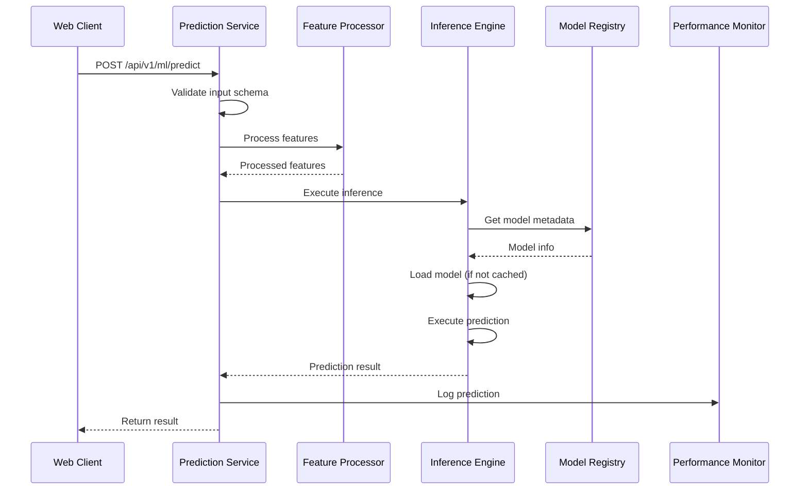

# ML Module Manager - Design Document

## Overview

The ML Module Manager is a framework-independent machine learning component designed to provide model lifecycle management, inference capabilities, and performance monitoring for IoT alert monitoring systems. The system architecture follows a modular design with clear separation of concerns, enabling extensibility through adapter patterns and maintaining independence from external ML frameworks.

### Key Design Principles

1. **Framework Independence**: No dependencies on TensorFlow, PyTorch, or other ML frameworks
2. **Lightweight Models**: JSON-based model formats for decision trees, rule-based systems, and isolation forests
3. **Extensibility**: Plugin architecture through model adapters for supporting new formats
4. **Performance**: Model caching and efficient inference execution
5. **Observability**: Comprehensive logging and performance monitoring
6. **Versioning**: Complete model version history with rollback capabilities

### System Context

The ML Module Manager operates as a server-side component within a larger IoT Alert Monitoring System. It receives prediction requests from the web application, processes device telemetry data, and returns predictions for anomaly detection, alert classification, and predictive maintenance scenarios.

## Architecture

### High-Level Component View

```
┌─────────────────────────────────────────────────────────────────┐
│                      ML Module Manager                          │
│                                                                 │
│  ┌──────────────────────────────────────────────────────────┐  │
│  │              Prediction Service (API Layer)              │  │
│  │  - Input validation                                      │  │
│  │  - Feature processing coordination                       │  │
│  │  - Result formatting                                     │  │
│  └────────────┬─────────────────────────────────┬───────────┘  │
│               │                                 │              │
│               ▼                                 ▼              │
│  ┌────────────────────────┐      ┌──────────────────────────┐  │
│  │   Inference Engine     │      │   Feature Processor      │  │
│  │  - Model loading       │      │  - Data transformation   │  │
│  │  - Model caching       │      │  - Feature engineering   │  │
│  │  - Prediction execution│      │  - Normalization         │  │
│  │  - Adapter management  │      └──────────────────────────┘  │
│  └────────────┬───────────┘                                    │
│               │                                                │
│               ▼                                                │
│  ┌────────────────────────┐      ┌──────────────────────────┐  │
│  │    Model Registry      │      │   Performance Monitor    │  │
│  │  - Model storage       │      │  - Prediction logging    │  │
│  │  - Version management  │      │  - Metrics calculation   │  │
│  │  - Metadata management │      │  - Throughput tracking   │  │
│  └────────────┬───────────┘      └──────────────────────────┘  │
│               │                                                │
│               ▼                                                │
│  ┌────────────────────────┐                                    │
│  │   MongoDB Database     │                                    │
│  │  - Model metadata      │                                    │
│  │  - Version history     │                                    │
│  │  - Performance logs    │                                    │
│  └────────────────────────┘                                    │
└─────────────────────────────────────────────────────────────────┘
```

### Component Interaction Flow



## Components and Interfaces

### 1. ML Module Manager (Orchestrator)

**Responsibility**: Main entry point that initializes and coordinates all subsystems.

**Public Interface**:
```javascript
class MLModuleManager {
  constructor(mongoDb, modelsPath)
  async initialize()
  async loadBuiltInModels()
  getComponents()
}
```

**Key Methods**:
- `initialize()`: Initializes all components and loads built-in models
- `loadBuiltInModels()`: Registers anomaly detection, alert classification, and predictive maintenance models
- `getComponents()`: Returns references to all subsystems for testing and debugging

### 2. Model Registry

**Responsibility**: Manages model storage, versioning, and metadata persistence.

**Public Interface**:
```javascript
class ModelRegistry {
  constructor(db, modelsPath)
  async initialize()
  async registerModel(modelFile, metadata)
  async listModels(filters)
  async getModel(modelId)
  async updateModel(modelId, modelFile, metadata)
  async deleteModel(modelId)
  async getVersionHistory(modelId)
  async updateStatus(modelId, status)
  async updatePerformanceMetrics(modelId, metrics)
}
```

**Storage Structure**:
```
models/
├── built-in/
│   ├── anomaly-detection/
│   │   └── model.json
│   ├── alert-classification/
│   │   └── model.json
│   └── predictive-maintenance/
│       └── model.json
└── custom/
    └── {modelId}/
        └── {version}/
            └── model.{format}
```

**Database Schema** (MongoDB):
```javascript
{
  model_id: String (unique),
  name: String,
  type: String, // 'anomaly_detection', 'classification', 'regression'
  format: String, // 'json', 'onnx', etc.
  description: String,
  current_version: String,
  status: String, // 'active', 'inactive', 'deprecated'
  input_schema: Object, // JSON Schema
  output_schema: Object, // JSON Schema
  model_path: String,
  checksum: String,
  performance_metrics: Object,
  versions: Array<{
    version: String,
    model_path: String,
    checksum: String,
    created_at: Date,
    created_by: String,
    status: String
  }>,
  tags: Array<String>,
  created_at: Date,
  updated_at: Date,
  created_by: String
}
```

### 3. Inference Engine

**Responsibility**: Loads models into memory and executes predictions using appropriate adapters.

**Public Interface**:
```javascript
class InferenceEngine {
  constructor(modelRegistry)
  registerAdapter(format, adapter)
  async loadModel(modelId, version)
  async unloadModel(modelId)
  async infer(modelId, features, version, timeout)
  getLoadedModels()
}
```

**Model Adapter Interface**:
```javascript
interface ModelAdapter {
  async load(modelPath): Model
  async verify(model, metadata): Boolean
  async predict(model, features, metadata): PredictionResult
}
```

**Caching Strategy**:
- Models are cached in memory using a Map with key format: `{modelId}:{version}`
- Cache entries include: model object, adapter reference, metadata, and load timestamp
- Models remain cached until explicitly unloaded or system restart

### 4. Prediction Service

**Responsibility**: Provides unified API for making predictions with input validation and result formatting.

**Public Interface**:
```javascript
class PredictionService {
  constructor(inferenceEngine, featureProcessor, performanceMonitor)
  async predict(modelId, inputData, version)
  async predictBatch(modelId, inputs, version)
}
```

**Request Format**:
```javascript
{
  model_id: String,
  input: {
    deviceId: String (optional),
    features: Object // Key-value pairs matching model input schema
  },
  version: String (optional)
}
```

**Response Format**:
```javascript
{
  predictionId: String,
  modelId: String,
  modelVersion: String,
  prediction: Object, // Model-specific prediction structure
  confidence: Number, // 0.0 to 1.0
  metadata: {
    processingTimeMs: Number,
    timestamp: Date,
    features: Object,
    anomaly_score: Number (optional)
  }
}
```

### 5. Feature Processor

**Responsibility**: Transforms raw input data into model-ready features.

**Public Interface**:
```javascript
class FeatureProcessor {
  constructor(mongoDb)
  async processFeatures(rawFeatures, modelId)
}
```

**Processing Pipeline**:
1. Feature extraction from raw input
2. Data type conversion
3. Missing value handling
4. Feature normalization (if required)
5. Feature validation against model schema

### 6. Performance Monitor

**Responsibility**: Tracks and logs model performance metrics.

**Public Interface**:
```javascript
class PerformanceMonitor {
  constructor(mongoDb)
  async initialize()
  async logPrediction(predictionLog)
  async getModelMetrics(modelId, timeRange)
  async getSystemMetrics()
}
```

**Metrics Tracked**:
- Total predictions per model
- Average latency (ms)
- Throughput (predictions/second)
- Accuracy (when ground truth available)
- Error rate
- Model-specific metrics (false positive rate, precision, etc.)

## Data Models

### Built-in Model Structures

#### 1. Anomaly Detection Model (Isolation Forest)

```javascript
{
  type: 'isolation_forest',
  threshold: Number, // Anomaly score threshold (0.0-1.0)
  max_depth: Number, // Maximum tree depth
  trees: Array<TreeNode>,
  input_schema: JSONSchema,
  output_schema: JSONSchema,
  performance_metrics: Object
}

// TreeNode structure
{
  type: 'node' | 'leaf',
  feature: String, // Feature name for splitting
  threshold: Number, // Split threshold
  left: TreeNode,
  right: TreeNode,
  depth: Number // For leaf nodes
}
```

**Prediction Algorithm**:
1. For each tree, traverse from root to leaf based on feature values
2. Record path length (depth) for each tree
3. Calculate average path length across all trees
4. Normalize score: `score = avg_depth / max_depth`
5. Classify: `anomaly = score > threshold`

#### 2. Alert Classification Model (Rule-Based)

```javascript
{
  type: 'rules',
  rules: Array<Rule>,
  default_prediction: Object,
  input_schema: JSONSchema,
  output_schema: JSONSchema,
  performance_metrics: Object
}

// Rule structure
{
  name: String,
  condition: {
    feature: String,
    operator: '>' | '>=' | '<' | '<=' | '==' | '!=',
    value: Number | String | Boolean
  },
  prediction: Object,
  confidence: Number
}
```

**Prediction Algorithm**:
1. Evaluate rules in sequential order
2. For each rule, check if condition matches input features
3. Return prediction from first matching rule
4. If no rules match, return default prediction with confidence 0.5

#### 3. Predictive Maintenance Model (Rule-Based Regression)

```javascript
{
  type: 'rules',
  rules: Array<Rule>,
  default_prediction: {
    failure_probability: Number,
    risk_level: String,
    estimated_days_to_failure: Number
  },
  input_schema: JSONSchema,
  output_schema: JSONSchema,
  performance_metrics: Object
}
```

**Prediction Algorithm**:
Same as alert classification but with regression-style outputs (probabilities and continuous values).

### Input/Output Schemas

#### Anomaly Detection
**Input**:
```javascript
{
  heartbeat_interval_ms: Number,
  signal_strength: Number,
  cpu_usage_percent: Number,
  memory_usage_percent: Number,
  error_count_1h: Number,
  restart_count_24h: Number,
  temperature_celsius: Number,
  uptime_hours: Number
}
```

**Output**:
```javascript
{
  prediction: 'normal' | 'anomaly',
  confidence: Number,
  anomaly_score: Number
}
```

#### Alert Classification
**Input**:
```javascript
{
  device_type: String,
  location: String,
  time_of_day: Number (0-23),
  day_of_week: Number (0-6),
  signal_pattern_length: Number,
  signal_amplitude: Number,
  historical_alert_count_7d: Number,
  quiet_hours: Boolean
}
```

**Output**:
```javascript
{
  prediction: {
    type: String, // 'smoke_alarm', 'glass_break', 'fall', etc.
    severity: String // 'critical', 'high', 'medium', 'low'
  },
  confidence: Number
}
```

#### Predictive Maintenance
**Input**:
```javascript
{
  device_age_days: Number,
  total_uptime_hours: Number,
  total_restarts: Number,
  avg_temperature_7d: Number,
  max_temperature_7d: Number,
  avg_cpu_usage_7d: Number,
  avg_memory_usage_7d: Number,
  error_rate_7d: Number,
  last_maintenance_days_ago: Number
}
```

**Output**:
```javascript
{
  prediction: {
    failure_probability: Number (0.0-1.0),
    estimated_days_to_failure: Number,
    risk_level: 'high' | 'medium' | 'low'
  },
  confidence: Number
}
```

## API Design

### RESTful Endpoints

#### 1. List Models
```
GET /api/v1/ml/models
Authorization: Bearer {token}

Query Parameters:
- type: String (optional) - Filter by model type
- status: String (optional) - Filter by status
- tags: String (optional) - Filter by tags (comma-separated)

Response: 200 OK
{
  models: Array<{
    model_id: String,
    name: String,
    version: String,
    type: String,
    status: String,
    created_at: Date,
    updated_at: Date,
    performance_metrics: Object
  }>
}
```

#### 2. Get Model Details
```
GET /api/v1/ml/models/:modelId
Authorization: Bearer {token}

Response: 200 OK
{
  model_id: String,
  name: String,
  type: String,
  format: String,
  description: String,
  current_version: String,
  status: String,
  input_schema: Object,
  output_schema: Object,
  performance_metrics: Object,
  versions: Array<Object>,
  tags: Array<String>,
  created_at: Date,
  updated_at: Date
}
```

#### 3. Register Model
```
POST /api/v1/ml/models
Authorization: Bearer {token}
Content-Type: multipart/form-data

Body:
- modelFile: File
- metadata: JSON {
    name: String,
    type: String,
    format: String,
    description: String,
    inputSchema: Object,
    outputSchema: Object,
    version: String (optional),
    tags: Array<String> (optional)
  }

Response: 201 Created
{
  model_id: String,
  message: String
}
```

#### 4. Update Model
```
PUT /api/v1/ml/models/:modelId
Authorization: Bearer {token}
Content-Type: multipart/form-data

Body:
- modelFile: File
- metadata: JSON {
    version: String (optional),
    description: String (optional),
    performanceMetrics: Object (optional)
  }

Response: 200 OK
{
  model_id: String,
  version: String,
  message: String
}
```

#### 5. Delete Model
```
DELETE /api/v1/ml/models/:modelId
Authorization: Bearer {token}

Response: 200 OK
{
  message: String
}
```

#### 6. Make Prediction
```
POST /api/v1/ml/predict
Authorization: Bearer {token}
Content-Type: application/json

Body:
{
  model_id: String,
  input: {
    deviceId: String (optional),
    features: Object
  },
  version: String (optional)
}

Response: 200 OK
{
  predictionId: String,
  modelId: String,
  modelVersion: String,
  prediction: Object,
  confidence: Number,
  metadata: {
    processingTimeMs: Number,
    timestamp: Date,
    features: Object
  }
}
```

#### 7. Batch Prediction
```
POST /api/v1/ml/predict/batch
Authorization: Bearer {token}
Content-Type: application/json

Body:
{
  model_id: String,
  inputs: Array<{
    deviceId: String (optional),
    features: Object
  }>,
  version: String (optional)
}

Response: 200 OK
{
  results: Array<PredictionResult | ErrorResult>
}
```

#### 8. Get System Status
```
GET /api/v1/ml/status
Authorization: Bearer {token}

Response: 200 OK
{
  status: 'operational' | 'degraded' | 'down',
  total_models: Number,
  loaded_models: Number,
  active_models: Number,
  uptime_seconds: Number
}
```

#### 9. Get Model Metrics
```
GET /api/v1/ml/models/:modelId/metrics
Authorization: Bearer {token}

Query Parameters:
- timeRange: String (optional) - '1h', '24h', '7d', '30d'

Response: 200 OK
{
  model_id: String,
  total_predictions: Number,
  accuracy: Number (optional),
  avg_latency_ms: Number,
  throughput: Number,
  error_rate: Number,
  time_range: String
}
```

#### 10. Get Version History
```
GET /api/v1/ml/models/:modelId/versions
Authorization: Bearer {token}

Response: 200 OK
{
  model_id: String,
  versions: Array<{
    version: String,
    created_at: Date,
    created_by: String,
    status: String,
    performance_metrics: Object
  }>
}
```

### Error Responses

All endpoints return consistent error format:
```javascript
{
  error: String, // Error type
  message: String, // Human-readable message
  details: Object (optional) // Additional context
}
```

**Common Status Codes**:
- 400 Bad Request: Invalid input data
- 401 Unauthorized: Missing or invalid authentication
- 404 Not Found: Model or resource not found
- 409 Conflict: Model ID already exists
- 500 Internal Server Error: Server-side error
- 503 Service Unavailable: System not initialized

## GUI Design

### Layout Structure

The ML Module Manager GUI is integrated into the admin dashboard as a dedicated section with three tabs:

```
┌─────────────────────────────────────────────────────────────┐
│  ML Module Manager                                          │
├─────────────────────────────────────────────────────────────┤
│  [Models] [Predict] [Performance]                           │
├─────────────────────────────────────────────────────────────┤
│                                                             │
│  Tab Content Area                                           │
│                                                             │
└─────────────────────────────────────────────────────────────┘
```

### Tab 1: Models

**Purpose**: Display and manage registered ML models

**Components**:
- Table with columns: Model Name, Type, Version, Status, Accuracy
- Status badges (green for active, yellow for inactive)
- Responsive table layout

**Sample Data Display**:
```
┌──────────────────────────────────────────────────────────────┐
│ Model Name              Type        Version  Status  Accuracy │
├──────────────────────────────────────────────────────────────┤
│ Anomaly Detection       anomaly     1.0.0    ●active  94.2%  │
│ Alert Classification    class       1.0.0    ●active  91.5%  │
│ Predictive Maintenance  regression  1.0.0    ●active  88.3%  │
└──────────────────────────────────────────────────────────────┘
```

**Implementation**:
```javascript
// Loads models and renders table
async function loadMLModels() {
  const response = await fetch(`${ML_API_BASE}/ml/models`, {
    headers: { Authorization: `Bearer ${token}` }
  });
  const data = await response.json();
  // Render table with model data
}
```

### Tab 2: Predict

**Purpose**: Execute predictions with interactive input

**Components**:
1. Model selector dropdown
2. Input textarea (JSON format) with sample data
3. "Make Prediction" button
4. Result display area

**Layout**:
```
┌─────────────────────────────────────────────────────────────┐
│ Select Model: [Anomaly Detection ▼]                        │
│                                                             │
│ Input Data (JSON):                                          │
│ ┌─────────────────────────────────────────────────────────┐ │
│ │ {                                                       │ │
│ │   "deviceId": "DEV-001",                               │ │
│ │   "features": {                                        │ │
│ │     "cpu_usage_percent": 78,                           │ │
│ │     "signal_strength": -45,                            │ │
│ │     ...                                                │ │
│ │   }                                                    │ │
│ │ }                                                      │ │
│ └─────────────────────────────────────────────────────────┘ │
│                                                             │
│ [Make Prediction]                                           │
│                                                             │
│ ┌─────────────────────────────────────────────────────────┐ │
│ │ ✅ Prediction Result                                    │ │
│ │ Prediction: "normal"                                    │ │
│ │ Confidence: 87.3%                                       │ │
│ │ Processing Time: 15ms                                   │ │
│ └─────────────────────────────────────────────────────────┘ │
└─────────────────────────────────────────────────────────────┘
```

**Sample Inputs** (Pre-configured for each model):
```javascript
const mlSampleInputs = {
  'anomaly-detection': {
    deviceId: 'DEV-001',
    features: {
      cpu_usage_percent: 78,
      signal_strength: -45,
      heartbeat_interval_ms: 5000,
      // ... other features
    }
  },
  'alert-classification': { /* ... */ },
  'predictive-maintenance': { /* ... */ }
};
```

**Implementation**:
```javascript
async function makeMLPrediction() {
  const modelId = document.getElementById('ml-predict-model').value;
  const input = JSON.parse(inputTextarea.value);
  
  const response = await fetch(`${ML_API_BASE}/ml/predict`, {
    method: 'POST',
    headers: {
      Authorization: `Bearer ${token}`,
      'Content-Type': 'application/json'
    },
    body: JSON.stringify({ model_id: modelId, input })
  });
  
  const result = await response.json();
  // Display formatted result
}
```

### Tab 3: Performance

**Purpose**: Monitor system and model performance metrics

**Components**:
1. System status cards (Total Models, Loaded Models, Status)
2. Model selector for detailed metrics
3. Model-specific metrics display

**Layout**:
```
┌─────────────────────────────────────────────────────────────┐
│ System Status                                               │
│ ┌──────────┐  ┌──────────┐  ┌──────────┐                  │
│ │ Status   │  │ Total    │  │ Loaded   │                  │
│ │ ●Active  │  │ Models   │  │ Models   │                  │
│ │          │  │    3     │  │    2     │                  │
│ └──────────┘  └──────────┘  └──────────┘                  │
│                                                             │
│ Model Metrics                                               │
│ Select Model: [Anomaly Detection ▼]                        │
│                                                             │
│ ┌──────────┐  ┌──────────┐  ┌──────────┐  ┌──────────┐   │
│ │ Total    │  │ Accuracy │  │ Avg      │  │ Through  │   │
│ │ Predict  │  │          │  │ Latency  │  │ put      │   │
│ │  1,247   │  │  94.2%   │  │  15ms    │  │  8.3/s   │   │
│ └──────────┘  └──────────┘  └──────────┘  └──────────┘   │
└─────────────────────────────────────────────────────────────┘
```

**Implementation**:
```javascript
async function loadMLSystemStatus() {
  const response = await fetch(`${ML_API_BASE}/ml/status`, {
    headers: { Authorization: `Bearer ${token}` }
  });
  const data = await response.json();
  // Render status cards
}

async function loadMLMetrics() {
  const modelId = document.getElementById('ml-metrics-model').value;
  const response = await fetch(
    `${ML_API_BASE}/ml/models/${modelId}/metrics`,
    { headers: { Authorization: `Bearer ${token}` } }
  );
  const data = await response.json();
  // Render metrics cards
}
```

### Styling

**Color Scheme**:
- Primary: #3b82f6 (blue)
- Success: #10b981 (green)
- Warning: #f59e0b (amber)
- Error: #ef4444 (red)
- Background: #f9fafb (light gray)
- Text: #1f2937 (dark gray)

**Typography**:
- Headers: 700 weight, 1.25rem-1.5rem
- Body: 400 weight, 1rem
- Monospace (code): 'Monaco', 'Courier New'

**Interactive Elements**:
- Buttons: Rounded corners (6px), padding (0.75rem 1.5rem)
- Inputs: Border (1px solid #d1d5db), focus ring (blue)
- Cards: Shadow (0 1px 3px rgba(0,0,0,0.1)), rounded (8px)

### Responsive Design

- Desktop (>1024px): Full three-column layout for metrics
- Tablet (768px-1024px): Two-column layout
- Mobile (<768px): Single column, stacked cards

### Error Handling

All API errors display in styled error containers:
```html
<div style="background: #fee2e2; border: 1px solid #fecaca; 
            color: #991b1b; padding: 1rem; border-radius: 6px;">
  <strong>Error:</strong> {error.message}
</div>
```

### Authentication

- Token stored in localStorage: `access_token`
- All requests include: `Authorization: Bearer ${token}`
- Expired tokens redirect to login page


## Correctness Properties

*A property is a characteristic or behavior that should hold true across all valid executions of a system-essentially, a formal statement about what the system should do. Properties serve as the bridge between human-readable specifications and machine-verifiable correctness guarantees.*

### Model Registry Properties

**Property 1: Model registration creates versioned storage**
*For any* model file and metadata, when uploaded through the Model Registry, the system should store the model with a unique identifier and version 1.0.0, and the model should be retrievable from both filesystem and database.
**Validates: Requirements 1.1**

**Property 2: Model listing returns complete metadata**
*For any* set of registered models, when listing models, all returned entries should contain model_id, name, version, type, status, and timestamps.
**Validates: Requirements 1.2**

**Property 3: Model updates preserve version history**
*For any* existing model, when updated with new model data, the version history array should grow by one entry, the current_version should change, and all previous versions should remain in the history.
**Validates: Requirements 1.3**

**Property 4: Model deletion removes all traces**
*For any* registered model, when deleted, subsequent attempts to retrieve the model should fail, and the model directory should not exist in the filesystem.
**Validates: Requirements 1.4**

**Property 5: Version history maintains integrity**
*For any* model with multiple versions, each version entry in the history should contain version number, model_path, created_at timestamp, and created_by information.
**Validates: Requirements 1.5**

### Built-in Models Properties

**Property 6: Initialization is idempotent**
*For any* system state, when the ML Module Manager initializes multiple times, the number of built-in models should remain constant at three (anomaly-detection, alert-classification, predictive-maintenance).
**Validates: Requirements 2.3**

**Property 7: Built-in model registration creates complete structure**
*For any* built-in model, after registration, the model should have a JSON file in the built-in directory and a database record with input_schema, output_schema, and performance_metrics.
**Validates: Requirements 2.2**

### Inference Engine Properties

**Property 8: Inference returns predictions with confidence**
*For any* valid model and input features, when executing inference, the result should contain a prediction field and a confidence value between 0.0 and 1.0.
**Validates: Requirements 3.1**

**Property 9: Models are cached after loading**
*For any* model, after the first inference request, the model should appear in the loaded models cache, and subsequent requests should not trigger file system reads.
**Validates: Requirements 3.4**

**Property 10: Version-specific inference uses correct version**
*For any* model with multiple versions, when requesting inference with a specific version parameter, the returned result should indicate that version was used, not the current version.
**Validates: Requirements 3.5**

**Property 11: Lazy loading occurs for uncached models**
*For any* model not in cache, when an inference request is made, the model should be loaded from storage before prediction execution.
**Validates: Requirements 3.2**

### Model Adapter Properties

**Property 12: Custom adapters are used for their formats**
*For any* custom adapter registered for a specific format, when loading a model with that format, the system should use the custom adapter's load and predict methods.
**Validates: Requirements 4.3**

**Property 13: Adapter selection matches model format**
*For any* model with a specified format, when loading the model, the Inference Engine should select the adapter that was registered for that exact format.
**Validates: Requirements 4.4**

### Input Validation Properties

**Property 14: Schema validation occurs before inference**
*For any* prediction request, the Prediction Service should validate input features against the model's input schema before calling the Inference Engine.
**Validates: Requirements 5.1**

**Property 15: Missing required fields produce validation errors**
*For any* model with required fields in its input schema, when input data omits one or more required fields, the Prediction Service should return an error listing the missing fields.
**Validates: Requirements 5.2**

**Property 16: Type mismatches produce validation errors**
*For any* input field with a schema-defined type, when the provided value has a different type, the Prediction Service should return a type mismatch error.
**Validates: Requirements 5.3**

**Property 17: Valid inputs proceed to inference**
*For any* input data that passes schema validation, the Prediction Service should execute inference and return a prediction result.
**Validates: Requirements 5.4**

**Property 18: Schemas are stored in JSON Schema format**
*For any* registered model, the input_schema and output_schema fields in the database should be valid JSON Schema objects.
**Validates: Requirements 5.5**

### Performance Monitoring Properties

**Property 19: Predictions are logged with complete metadata**
*For any* completed prediction, the Performance Monitor should create a log entry containing predictionId, modelId, input, output, and timestamp.
**Validates: Requirements 6.1**

**Property 20: Metrics include all required statistics**
*For any* model with logged predictions, when requesting metrics, the response should contain total_predictions, avg_latency_ms, and throughput fields.
**Validates: Requirements 6.2**

**Property 21: Metrics updates include timestamps**
*For any* performance metrics update, the stored metrics should include a last_evaluated timestamp.
**Validates: Requirements 6.3**

**Property 22: Throughput calculation is accurate**
*For any* set of predictions made within a time period, the calculated throughput should equal the number of predictions divided by the time period in seconds.
**Validates: Requirements 6.4**

**Property 23: Processing time is tracked per prediction**
*For any* prediction, the result metadata should include a processingTimeMs field with a non-negative number.
**Validates: Requirements 6.5**

### Batch Prediction Properties

**Property 24: Batch predictions return arrays**
*For any* batch prediction request with N inputs, the response should contain an array with exactly N elements.
**Validates: Requirements 7.1**

**Property 25: Batch errors don't stop processing**
*For any* batch prediction request where some inputs are invalid, the response should contain error objects for invalid inputs and prediction results for valid inputs.
**Validates: Requirements 7.2**

**Property 26: Batch results preserve input order**
*For any* batch prediction request, the order of results in the response array should match the order of inputs in the request array.
**Validates: Requirements 7.3**

**Property 27: Batch predictions use consistent version**
*For any* batch prediction request with a specified version, all predictions in the batch should use that same version.
**Validates: Requirements 7.4**

**Property 28: Batch predictions are logged individually**
*For any* batch prediction request with N inputs, the Performance Monitor should create N separate log entries.
**Validates: Requirements 7.5**

### GUI Properties

**Property 29: Model selection loads appropriate sample data**
*For any* model in the Predict tab dropdown, when selected, the input textarea should be populated with sample data that matches that model's input schema.
**Validates: Requirements 8.3**

**Property 30: API requests include authentication**
*For any* API request made by the GUI, the request headers should include an Authorization header with a bearer token from localStorage.
**Validates: Requirements 8.7**

**Property 31: API errors display error containers**
*For any* API request that returns an error status code, the GUI should display a styled error container with the error message.
**Validates: Requirements 8.8**

### API Properties

**Property 32: Unauthenticated requests are rejected**
*For any* ML API endpoint, when called without a valid bearer token, the response should have status code 401 Unauthorized.
**Validates: Requirements 9.5**

**Property 33: API responses are JSON formatted**
*For any* ML API endpoint response, the Content-Type header should be application/json and the body should be valid JSON.
**Validates: Requirements 9.6**

### JSON Model Adapter Properties

**Property 34: Decision trees traverse correctly**
*For any* decision tree model and input features, the prediction should be determined by traversing from root to leaf, comparing feature values against thresholds at each node.
**Validates: Requirements 10.1**

**Property 35: Rules evaluate in order**
*For any* rule-based model with multiple rules, the prediction should come from the first rule whose condition evaluates to true.
**Validates: Requirements 10.2**

**Property 36: Isolation forest calculates anomaly scores**
*For any* isolation forest model and input features, the prediction should include an anomaly_score calculated as the average path length across all trees normalized by max_depth.
**Validates: Requirements 10.3**

**Property 37: Unmatched rules return default**
*For any* rule-based model where no rule conditions match the input, the prediction should be the model's default_prediction.
**Validates: Requirements 10.4**

**Property 38: All comparison operators work correctly**
*For any* rule with a comparison operator (>, >=, <, <=, ==, !=), the condition should evaluate correctly according to JavaScript comparison semantics.
**Validates: Requirements 10.5**

## Error Handling

### Error Categories

1. **Validation Errors** (400 Bad Request)
   - Missing required fields
   - Type mismatches
   - Invalid JSON format
   - Schema validation failures

2. **Authentication Errors** (401 Unauthorized)
   - Missing bearer token
   - Invalid or expired token

3. **Not Found Errors** (404 Not Found)
   - Model ID does not exist
   - Version not found
   - Resource not found

4. **Conflict Errors** (409 Conflict)
   - Model ID already exists
   - Version already exists

5. **Timeout Errors** (408 Request Timeout)
   - Inference execution exceeds timeout threshold

6. **Server Errors** (500 Internal Server Error)
   - Database connection failures
   - File system errors
   - Unexpected exceptions

7. **Service Unavailable** (503 Service Unavailable)
   - System not initialized
   - Database not connected

### Error Response Format

All errors follow a consistent structure:
```javascript
{
  error: String, // Error type identifier
  message: String, // Human-readable description
  details: Object (optional) // Additional context
}
```

### Error Handling Strategies

**Model Registry**:
- File system errors: Log error, return 500, preserve database consistency
- Duplicate model IDs: Return 409 with existing model info
- Missing models: Return 404 with model ID in message

**Inference Engine**:
- Model load failures: Log error, clear cache entry, return 500
- Timeout: Terminate inference, log timeout, return 408
- Unsupported format: Return 400 with list of supported formats
- Verification failures: Log details, return 500

**Prediction Service**:
- Validation errors: Return 400 with specific field errors
- Missing features: Return 400 with list of missing fields
- Type errors: Return 400 with expected vs actual types

**Performance Monitor**:
- Log write failures: Log to console, continue operation (non-blocking)
- Metrics calculation errors: Return partial metrics with warning

**GUI**:
- API errors: Display error container with message
- Network errors: Display "Connection failed" message
- Timeout: Display "Request timed out, please try again"

### Retry Logic

- **Transient Errors**: Retry up to 3 times with exponential backoff (1s, 2s, 4s)
- **Non-Transient Errors**: Fail immediately without retry
- **Timeout**: No retry, return error immediately

### Logging

All errors are logged with:
- Timestamp
- Error type and message
- Stack trace (for server errors)
- Request context (model ID, user ID, etc.)
- Correlation ID for tracing

## Testing Strategy

### Unit Testing

**Framework**: Jest (JavaScript)

**Coverage Areas**:
1. **Model Registry**
   - Model registration with valid metadata
   - Model listing with filters
   - Version increment logic
   - File path generation
   - Checksum calculation

2. **Inference Engine**
   - Adapter registration
   - Model caching logic
   - Cache key generation
   - Timeout handling

3. **JSON Model Adapter**
   - Decision tree traversal with known trees
   - Rule evaluation with specific conditions
   - Isolation forest scoring with sample trees
   - Operator evaluation for each type

4. **Prediction Service**
   - Input validation against schemas
   - Error message formatting
   - Result structure formatting

5. **Feature Processor**
   - Feature extraction
   - Type conversion
   - Missing value handling

6. **Performance Monitor**
   - Metrics calculation
   - Throughput computation
   - Log entry creation

**Test Organization**:
```
tests/
├── unit/
│   ├── ModelRegistry.test.js
│   ├── InferenceEngine.test.js
│   ├── JSONModelAdapter.test.js
│   ├── PredictionService.test.js
│   ├── FeatureProcessor.test.js
│   └── PerformanceMonitor.test.js
```

### Property-Based Testing

**Framework**: fast-check (JavaScript)

**Configuration**: Minimum 100 iterations per property test

**Property Test Coverage**:

Each property-based test must be tagged with the format:
`**Feature: ml-module-documentation, Property {number}: {property_text}**`

**Test Organization**:
```
tests/
├── properties/
│   ├── ModelRegistry.properties.test.js
│   ├── InferenceEngine.properties.test.js
│   ├── PredictionService.properties.test.js
│   ├── BatchPrediction.properties.test.js
│   └── JSONModelAdapter.properties.test.js
```

**Generators**:
- `arbitraryModelMetadata()`: Generates valid model metadata objects
- `arbitraryFeatures(schema)`: Generates features matching a schema
- `arbitraryDecisionTree(maxDepth)`: Generates valid decision tree structures
- `arbitraryRuleSet()`: Generates rule-based model configurations
- `arbitraryIsolationForest(numTrees)`: Generates isolation forest models

**Example Property Test**:
```javascript
// Feature: ml-module-documentation, Property 1: Model registration creates versioned storage
test('Property 1: Model registration creates versioned storage', async () => {
  await fc.assert(
    fc.asyncProperty(
      arbitraryModelMetadata(),
      arbitraryModelFile(),
      async (metadata, modelFile) => {
        const modelId = await modelRegistry.registerModel(modelFile, metadata);
        const retrieved = await modelRegistry.getModel(modelId);
        
        expect(retrieved).toBeDefined();
        expect(retrieved.model_id).toBe(modelId);
        expect(retrieved.current_version).toBe('1.0.0');
        expect(retrieved.versions).toHaveLength(1);
      }
    ),
    { numRuns: 100 }
  );
});
```

### Integration Testing

**Scope**: Test component interactions

**Test Scenarios**:
1. End-to-end prediction flow: API → Prediction Service → Inference Engine → Model Registry
2. Model registration and immediate inference
3. Batch prediction with mixed valid/invalid inputs
4. Performance monitoring across multiple predictions
5. Version switching during active inference

**Test Environment**:
- In-memory MongoDB instance
- Temporary file system directory
- Mock authentication middleware

### API Testing

**Framework**: Supertest

**Coverage**:
- All REST endpoints
- Authentication enforcement
- Request/response formats
- Error status codes
- Content-Type headers

### GUI Testing

**Framework**: Playwright or Cypress

**Coverage**:
- Tab switching
- Model selection and sample data loading
- Prediction execution and result display
- Error message display
- Metrics loading

**Test Approach**:
- Mock API responses for predictable testing
- Test authentication token handling
- Verify DOM elements and styling
- Test responsive layout

### Performance Testing

**Tools**: Artillery or k6

**Metrics**:
- Throughput: Predictions per second
- Latency: P50, P95, P99 response times
- Concurrent users: System behavior under load
- Memory usage: Model caching impact

**Scenarios**:
- Single model, sequential predictions
- Multiple models, concurrent predictions
- Batch predictions with varying sizes
- Model loading under concurrent requests

### Test Data

**Built-in Model Test Data**:
- Anomaly detection: Normal and anomalous device metrics
- Alert classification: Various alert types and severities
- Predictive maintenance: Devices at different risk levels

**Edge Cases**:
- Empty feature objects
- Missing required fields
- Extreme numeric values
- Very large batch sizes
- Models with many versions

## Deployment Considerations

### System Requirements

**Server**:
- Node.js 16+ runtime
- MongoDB 4.4+ database
- 2GB RAM minimum (4GB recommended)
- 10GB disk space for model storage

**Client**:
- Modern web browser (Chrome 90+, Firefox 88+, Safari 14+)
- JavaScript enabled
- LocalStorage support

### Configuration

**Environment Variables**:
```bash
# Database
MONGODB_URI=mongodb://localhost:27017/iot_alerts

# ML Module
ML_MODELS_PATH=./models
ML_INFERENCE_TIMEOUT=30000
ML_CACHE_SIZE=10

# API
API_BASE_URL=http://localhost:3000/api/v1
JWT_SECRET=your-secret-key
```

### Initialization Sequence

1. Connect to MongoDB
2. Initialize Model Registry (create indexes, directories)
3. Initialize Performance Monitor (create collections)
4. Initialize Inference Engine (register adapters)
5. Load built-in models
6. Start API server

### Monitoring

**Health Checks**:
- `/api/v1/ml/status`: System operational status
- Database connectivity
- Model registry accessibility
- Loaded models count

**Metrics to Track**:
- Total predictions per hour
- Average latency per model
- Error rate
- Cache hit rate
- Disk usage for model storage

### Backup and Recovery

**Model Backup**:
- Regular backup of models directory
- MongoDB backup of model metadata
- Version history preservation

**Recovery Procedures**:
- Restore models directory from backup
- Restore MongoDB collections
- Re-initialize ML Module Manager
- Verify built-in models are loaded

### Scaling Considerations

**Horizontal Scaling**:
- Stateless API design allows multiple instances
- Shared MongoDB for model metadata
- Shared file system (NFS/S3) for model files
- Load balancer for request distribution

**Vertical Scaling**:
- Increase memory for more cached models
- Increase CPU for faster inference
- Increase disk for more model versions

**Optimization**:
- Model caching reduces load times
- Batch predictions improve throughput
- Async processing for non-critical operations
- Connection pooling for database

## Future Enhancements

### Planned Features

1. **Model Training API**: Allow users to train models from historical data
2. **A/B Testing**: Compare multiple model versions in production
3. **Model Explainability**: Provide feature importance and prediction explanations
4. **Auto-scaling**: Automatically load/unload models based on usage
5. **Model Marketplace**: Share and download community models
6. **Real-time Monitoring Dashboard**: Live metrics and alerts
7. **Model Drift Detection**: Identify when model performance degrades
8. **Multi-tenancy**: Isolate models per tenant/organization

### Extensibility Points

1. **Custom Adapters**: Support for ONNX, TensorFlow.js, PyTorch Mobile
2. **Feature Transformers**: Plugin system for custom feature engineering
3. **Prediction Pipelines**: Chain multiple models together
4. **Custom Metrics**: User-defined performance metrics
5. **Webhooks**: Notify external systems of predictions or events

### Research Areas

1. **Federated Learning**: Train models across distributed devices
2. **Model Compression**: Reduce model size for edge deployment
3. **Quantization**: Optimize models for faster inference
4. **AutoML**: Automatically select and tune models
5. **Transfer Learning**: Adapt pre-trained models to new domains
