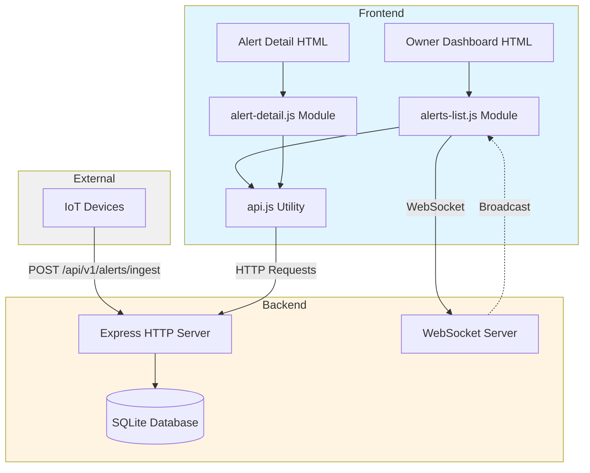

# Design Document

## Overview

The Alert Monitoring System is a full-stack application consisting of a Node.js/Express backend with PostgreSQL and MongoDB persistence, JWT-based authentication, WebSocket server for real-time updates, and a React-based System Dashboard. The system enables IoT devices to ingest alerts and telemetry, property owners to view and manage alerts in real-time with comprehensive KPIs and filtering, and maintains a complete audit trail of all alert lifecycle events.

### Key Design Principles

- **Real-time First**: WebSocket connections ensure sub-second update propagation to all connected clients
- **Secure by Default**: JWT authentication and role-based access control protect all API endpoints
- **Polyglot Persistence**: PostgreSQL for relational data, MongoDB for time-series telemetry and ML inference
- **Audit Trail**: Every alert action is recorded in history for compliance and debugging
- **Separation of Concerns**: Backend handles business logic and persistence; frontend handles presentation and user interaction
- **Component-Based UI**: React dashboard with modular components for maintainability and reusability
- **Scalable Architecture**: Designed for horizontal scaling with database connection pooling and stateless API

## Architecture

### System Components



### Technology Stack

**Backend:**
- Node.js with Express 4.19.2 for HTTP API
- pg 8.11.0 for PostgreSQL connection pooling
- mongodb 6.3.0 for MongoDB time-series operations
- ws 8.18.0 for WebSocket server
- jsonwebtoken 9.0.2 for JWT generation and validation
- bcrypt 5.1.1 for password hashing
- nanoid 4.0.2 for unique ID generation
- cors 2.8.5 for cross-origin resource sharing
- dotenv 16.3.1 for environment configuration

**Frontend:**
- React 18.2.0 with TypeScript for type safety
- React Router 6.20.0 for client-side routing
- Recharts 2.10.0 for data visualization
- date-fns 2.30.0 for date formatting
- Vite 5.0.0 for development server and build tooling

**Databases:**
- PostgreSQL 15+ for relational data (users, houses, devices, alerts, refresh_tokens)
- MongoDB 7+ for time-series data (telemetry, ml_inference)

**Authentication:**
- JWT with RS256 algorithm
- Access tokens: 1 hour expiration
- Refresh tokens: 7 day expiration, stored in database

### Deployment Model

- Backend runs on port 3000 (configurable via PORT environment variable)
- Frontend served by Vite dev server on port 5173 (development)
- WebSocket endpoint at `ws://localhost:3000/ws`
- PostgreSQL on port 5432 (configurable via DB_URL)
- MongoDB on port 27017 (configurable via MONGO_URL)
- CORS enabled for cross-origin requests during development
- Environment variables managed via .env file

## Components and Interfaces

### Backend Components

#### 1. Express HTTP Server

**Responsibilities:**
- Handle REST API requests for alert operations
- Validate request parameters
- Execute database operations
- Trigger WebSocket broadcasts
- Return JSON responses

**Endpoints:**

| Method | Path | Purpose | Auth | Request Body | Response |
|--------|------|---------|------|--------------|----------|
| POST | /api/v1/auth/login | User login | No | `{email, password}` | `{access_token, refresh_token, user}` |
| POST | /api/v1/auth/refresh | Refresh token | No | `{refresh_token}` | `{access_token}` |
| POST | /api/v1/auth/logout | User logout | No | `{refresh_token}` | `{success: true}` |
| POST | /api/v1/auth/register | Register user (admin) | Yes | `{name, email, password, role}` | `{user}` |
| GET | /api/v1/houses | List houses | Yes | - | `{items: House[]}` |
| GET | /api/v1/devices | List devices | Yes | Query: `owner_id?, house_id?, status?, page?, pageSize?` | `{items: Device[], total, page}` |
| POST | /api/v1/devices | Register device | Yes | `{owner_id, house_id, device_type, name}` | `{device}` |
| GET | /api/v1/devices/:id | Get device details | Yes | - | `{device, house, telemetry_summary}` |
| POST | /api/v1/devices/:id/metrics | Ingest telemetry | Yes | `{timestamp, metrics: {snr, rms, decibel}}` | `{success: true, doc_id}` |
| GET | /api/v1/metrics/alerts-by-day | Daily alert metrics | Yes | Query: `owner_id?, start_date?, end_date?` | `{items: [{date, total, high, critical}]}` |
| GET | /api/v1/metrics/device/:id | Device metrics | Yes | - | `{device_id, uptimePct, alertsGenerated, avgSnr, lastSeen}` |
| POST | /api/v1/ml/predict | ML inference | Yes | `{device_id, window_uri, ts, features}` | `{prediction, score, inference_id}` |
| POST | /api/v1/alerts/ingest | Create new alert | Yes | `{house_id, device_id, type, message, score?, duration?}` | `{id, severity, state}` |
| POST | /api/v1/alerts/search | Query alerts | Yes | `{severity?, status?, type?, since?, limit?}` | `{items: Alert[]}` |
| GET | /api/v1/alerts/stats | KPI metrics | Yes | - | `{openCount, mttaSec, mttrSec, bySeverity, byState}` |
| GET | /api/v1/alerts/:id | Get alert details | Yes | - | `{alert: Alert, history: History[]}` |
| POST | /api/v1/alerts/:id/ack | Acknowledge alert | Yes | `{actor, note?}` | `{state, acknowledged_at}` |
| POST | /api/v1/alerts/:id/escalate | Escalate alert | Yes | `{actor, note?}` | `{state, escalation_level}` |
| POST | /api/v1/alerts/:id/resolve | Resolve alert | Yes | `{actor, note}` | `{state, resolved_at}` |

#### 2. WebSocket Server

**Responsibilities:**
- Accept WebSocket connections at `/ws` path
- Send welcome message on connection
- Broadcast alert events to all connected clients
- Handle client disconnections gracefully

**Message Format:**
```json
{
  "type": "alert.created" | "alert.updated" | "hello",
  "payload": Alert | "connected"
}
```

**Connection Lifecycle:**
1. Client connects to `ws://localhost:5174/ws`
2. Server sends `{"type": "hello", "payload": "connected"}`
3. Server broadcasts alert events as they occur
4. Client maintains connection for duration of session

#### 3. Database Layer

**PostgreSQL Schema:**

```sql
CREATE TABLE users (
  user_id UUID PRIMARY KEY DEFAULT gen_random_uuid(),
  name VARCHAR(255) NOT NULL,
  email VARCHAR(255) UNIQUE NOT NULL,
  password_hash VARCHAR(255) NOT NULL,
  role VARCHAR(50) NOT NULL CHECK (role IN ('OWNER', 'ADMIN', 'STAFF', 'CAREGIVER')),
  created_at TIMESTAMP DEFAULT CURRENT_TIMESTAMP
);

CREATE TABLE houses (
  house_id UUID PRIMARY KEY DEFAULT gen_random_uuid(),
  owner_id UUID NOT NULL REFERENCES users(user_id),
  address TEXT NOT NULL,
  timezone VARCHAR(50) DEFAULT 'UTC',
  created_at TIMESTAMP DEFAULT CURRENT_TIMESTAMP
);

CREATE TABLE devices (
  device_id UUID PRIMARY KEY DEFAULT gen_random_uuid(),
  house_id UUID NOT NULL REFERENCES houses(house_id),
  device_type VARCHAR(50) NOT NULL,
  status VARCHAR(50) DEFAULT 'active' CHECK (status IN ('active', 'inactive', 'decommissioned')),
  name VARCHAR(255) NOT NULL,
  firmware VARCHAR(50),
  config JSONB,
  last_seen TIMESTAMP,
  created_at TIMESTAMP DEFAULT CURRENT_TIMESTAMP,
  updated_at TIMESTAMP DEFAULT CURRENT_TIMESTAMP
);

CREATE TABLE alerts (
  alert_id UUID PRIMARY KEY DEFAULT gen_random_uuid(),
  house_id UUID NOT NULL REFERENCES houses(house_id),
  device_id UUID NOT NULL REFERENCES devices(device_id),
  type VARCHAR(50) NOT NULL,
  severity VARCHAR(20) NOT NULL CHECK (severity IN ('low', 'medium', 'high', 'critical')),
  state VARCHAR(20) NOT NULL CHECK (state IN ('new', 'acked', 'escalated', 'resolved')),
  status VARCHAR(20) NOT NULL CHECK (status IN ('open', 'acknowledged', 'escalated', 'resolved')),
  score REAL,
  message TEXT,
  occurred_at TIMESTAMP NOT NULL,
  created_at TIMESTAMP DEFAULT CURRENT_TIMESTAMP,
  updated_at TIMESTAMP DEFAULT CURRENT_TIMESTAMP,
  acknowledged_by UUID REFERENCES users(user_id),
  acknowledged_at TIMESTAMP,
  escalated_at TIMESTAMP,
  escalation_level INTEGER DEFAULT 0,
  resolved_by UUID REFERENCES users(user_id),
  resolved_at TIMESTAMP
);

CREATE TABLE alert_history (
  history_id UUID PRIMARY KEY DEFAULT gen_random_uuid(),
  alert_id UUID NOT NULL REFERENCES alerts(alert_id),
  action VARCHAR(50) NOT NULL,
  actor UUID REFERENCES users(user_id),
  note TEXT,
  meta JSONB,
  ts TIMESTAMP DEFAULT CURRENT_TIMESTAMP
);

CREATE TABLE refresh_tokens (
  token_id UUID PRIMARY KEY DEFAULT gen_random_uuid(),
  user_id UUID NOT NULL REFERENCES users(user_id),
  token TEXT UNIQUE NOT NULL,
  revoked BOOLEAN DEFAULT FALSE,
  expires_at TIMESTAMP NOT NULL,
  created_at TIMESTAMP DEFAULT CURRENT_TIMESTAMP
);

CREATE INDEX idx_alerts_house_id ON alerts(house_id);
CREATE INDEX idx_alerts_device_id ON alerts(device_id);
CREATE INDEX idx_alerts_state ON alerts(state);
CREATE INDEX idx_alerts_occurred_at ON alerts(occurred_at DESC);
CREATE INDEX idx_devices_house_id ON devices(house_id);
CREATE INDEX idx_refresh_tokens_user_id ON refresh_tokens(user_id);
CREATE INDEX idx_refresh_tokens_token ON refresh_tokens(token) WHERE NOT revoked;
```

**MongoDB Collections:**

```javascript
// telemetry collection (time-series)
{
  device_id: UUID,
  ts: ISODate,
  metrics: {
    snr: Number,
    rms: Number,
    decibel: Number,
    // additional sensor metrics
  }
}

// ml_inference collection
{
  inference_id: ObjectId,
  alert_id: UUID (optional),
  device_id: UUID,
  ts: ISODate,
  model_name: String,
  score: Number,
  label: String,
  window_uri: String,
  features: Object
}
```

**Connection Pooling:**
- PostgreSQL: pg.Pool with max 20 connections
- MongoDB: MongoClient with connection pooling enabled
- Environment-based configuration for connection strings

**Design Decisions:**
- UUID primary keys for distributed system compatibility
- Foreign key constraints for referential integrity
- JSONB for flexible configuration and metadata storage
- Indexes on frequently queried columns for performance
- Separate time-series database for high-volume telemetry data
- Timestamp columns use PostgreSQL TIMESTAMP type for timezone support

#### 4. Authentication System

**JWT Implementation:**

```javascript
// Token generation
const accessToken = jwt.sign(
  { user_id, email, role },
  process.env.JWT_SECRET,
  { expiresIn: '1h', algorithm: 'HS256' }
);

const refreshToken = nanoid(64);
// Store in refresh_tokens table with 7-day expiration
```

**Middleware:**

```javascript
// authMiddleware.js
async function authenticate(req, res, next) {
  const token = req.headers.authorization?.replace('Bearer ', '');
  if (!token) return res.status(401).json({ error: 'Authentication required' });
  
  try {
    const decoded = jwt.verify(token, process.env.JWT_SECRET);
    req.user = decoded;
    next();
  } catch (err) {
    return res.status(401).json({ error: 'Invalid or expired token' });
  }
}

function requireRole(...roles) {
  return (req, res, next) => {
    if (!roles.includes(req.user.role)) {
      return res.status(403).json({ error: 'Insufficient permissions' });
    }
    next();
  };
}
```

**Password Security:**
- bcrypt with salt rounds = 10
- Passwords never stored in plain text
- Password validation on registration (min 8 chars, complexity rules)

**Token Refresh Flow:**
1. Client sends refresh_token to /auth/refresh
2. Server validates token exists and not revoked
3. Server checks expiration
4. Server generates new access_token
5. Server marks old refresh_token as revoked (optional: rotate refresh tokens)
6. Server returns new access_token

**Security Considerations:**
- JWT_SECRET stored in environment variable (min 256 bits)
- HTTPS required in production
- Refresh tokens stored with secure flag
- Rate limiting on auth endpoints (5 attempts per 15 minutes)
- Token blacklisting for immediate logout

#### 5. Severity Rules Engine

**Implementation:**
```javascript
const RULES = {
  glass_break: 'high',
  smoke_alarm: 'critical',
  dog_bark: 'low'
};
```

**Logic:**
- Lookup alert type in RULES map
- Default to 'low' severity if type not found
- Applied during alert ingestion

**Extensibility:**
- Add new rules by extending RULES object
- Consider moving to database table for dynamic configuration in future

### Frontend Components (React Dashboard)

#### 1. Application Structure

```
src/
├── components/
│   ├── auth/
│   │   ├── LoginForm.tsx
│   │   └── ProtectedRoute.tsx
│   ├── dashboard/
│   │   ├── DashboardHome.tsx
│   │   ├── KPICard.tsx
│   │   ├── SeverityChart.tsx
│   │   └── AlertsTrendChart.tsx
│   ├── alerts/
│   │   ├── LiveAlertsFeed.tsx
│   │   ├── AlertHistory.tsx
│   │   ├── AlertDetailDrawer.tsx
│   │   ├── AlertRow.tsx
│   │   ├── AlertFilters.tsx
│   │   └── BulkActions.tsx
│   ├── devices/
│   │   ├── DeviceList.tsx
│   │   ├── DeviceForm.tsx
│   │   └── DeviceMetrics.tsx
│   └── common/
│       ├── SeverityChip.tsx
│       ├── StateChip.tsx
│       ├── Toast.tsx
│       └── LoadingSpinner.tsx
├── services/
│   ├── api.ts
│   ├── auth.ts
│   ├── alerts.ts
│   ├── devices.ts
│   └── websocket.ts
├── hooks/
│   ├── useAuth.ts
│   ├── useWebSocket.ts
│   ├── useAlerts.ts
│   └── useToast.ts
├── context/
│   ├── AuthContext.tsx
│   └── WebSocketContext.tsx
├── types/
│   ├── alert.ts
│   ├── device.ts
│   └── user.ts
└── App.tsx
```

#### 2. Core React Components

**DashboardHome Component:**
- Displays 4 KPI cards: Open Alerts, MTTA, MTTR, Total Alerts
- Renders SeverityChart (bar chart) showing alert counts by severity
- Renders AlertsTrendChart (line chart) showing alerts over last 7 days
- Fetches data from /api/v1/alerts/stats on mount
- Subscribes to WebSocket for real-time KPI updates

**LiveAlertsFeed Component:**
- Displays alerts table with columns: Time, House, Device, Type, Severity, State, Score, Actions
- Fetches initial data from /api/v1/alerts/search with state filter (new, escalated)
- Subscribes to WebSocket for alert.new and alert.acked events
- Provides inline Acknowledge and Escalate buttons
- Updates rows in place when state changes
- Implements optimistic UI updates

**AlertHistory Component:**
- Provides filter bar with date range picker, severity multi-select, state select, house/device dropdowns
- Fetches filtered data from /api/v1/alerts/search
- Implements pagination with page size selector (25, 50, 100)
- Supports row selection with checkboxes
- Provides bulk acknowledge button for selected rows
- Debounces filter changes (300ms) to reduce API calls

**AlertDetailDrawer Component:**
- Displays alert header with type, severity chip, state chip, timestamps
- Shows context section with house address, device name, ML score
- Renders history timeline with action icons, timestamps, actors, notes
- Provides state-aware action buttons:
  - New: Acknowledge, Escalate
  - Acked: Resolve
  - Escalated: Acknowledge, Resolve
  - Resolved: No actions
- Implements resolve modal with required note field
- Handles 409 conflicts with toast notification and refresh

**DeviceList Component:**
- Displays devices table with filters for house, status, type
- Provides "Register Device" button opening DeviceForm modal
- Shows device metrics summary on row click
- Implements pagination

#### 3. API Service Layer (`services/api.ts`)

```typescript
class ApiService {
  private baseURL: string;
  private accessToken: string | null;

  async request<T>(
    method: string,
    path: string,
    body?: any,
    requiresAuth = true
  ): Promise<T> {
    const headers: HeadersInit = {
      'Content-Type': 'application/json',
    };

    if (requiresAuth && this.accessToken) {
      headers['Authorization'] = `Bearer ${this.accessToken}`;
    }

    const response = await fetch(`${this.baseURL}${path}`, {
      method,
      headers,
      body: body ? JSON.stringify(body) : undefined,
    });

    if (response.status === 401) {
      // Attempt token refresh
      await this.refreshToken();
      // Retry request
      return this.request(method, path, body, requiresAuth);
    }

    if (!response.ok) {
      const error = await response.json();
      throw new Error(error.error || 'Request failed');
    }

    return response.json();
  }

  async refreshToken(): Promise<void> {
    const refreshToken = localStorage.getItem('refresh_token');
    if (!refreshToken) throw new Error('No refresh token');

    const { access_token } = await this.request<{ access_token: string }>(
      'POST',
      '/api/v1/auth/refresh',
      { refresh_token: refreshToken },
      false
    );

    this.accessToken = access_token;
    localStorage.setItem('access_token', access_token);
  }
}
```

#### 4. WebSocket Hook (`hooks/useWebSocket.ts`)

```typescript
function useWebSocket() {
  const [connected, setConnected] = useState(false);
  const [reconnecting, setReconnecting] = useState(false);
  const wsRef = useRef<WebSocket | null>(null);
  const reconnectAttempts = useRef(0);

  const connect = useCallback(() => {
    const ws = new WebSocket(`ws://${location.hostname}:3000/ws`);

    ws.onopen = () => {
      setConnected(true);
      setReconnecting(false);
      reconnectAttempts.current = 0;
    };

    ws.onclose = () => {
      setConnected(false);
      if (reconnectAttempts.current < 10) {
        setReconnecting(true);
        const delay = Math.min(1000 * Math.pow(2, reconnectAttempts.current), 30000);
        setTimeout(() => {
          reconnectAttempts.current++;
          connect();
        }, delay);
      }
    };

    ws.onmessage = (event) => {
      const message = JSON.parse(event.data);
      // Dispatch to event handlers
      window.dispatchEvent(new CustomEvent('ws-message', { detail: message }));
    };

    wsRef.current = ws;
  }, []);

  useEffect(() => {
    connect();
    return () => wsRef.current?.close();
  }, [connect]);

  return { connected, reconnecting };
}
```

#### 5. Legacy API Utility Module (`assets/js/api.js`)

**Responsibilities:**
- Provide reusable HTTP request functions
- Handle API base URL configuration
- Centralize error handling
- Abstract fetch API details

**Interface:**
```javascript
export const API_BASE: string;
export async function post(path: string, body?: object): Promise<any>;
export async function get(path: string): Promise<any>;
```

**Design Decisions:**
- Detect localhost to use development API URL
- Throw errors for non-2xx responses
- Always send/expect JSON content type

#### 2. Alerts List Module (`assets/js/alerts-list.js`)

**Responsibilities:**
- Load and display alerts table
- Handle WebSocket connection for live updates
- Manage alert generator buttons
- Implement status filtering
- Update alert count display

**Key Functions:**
- `rowHtml(alert)`: Generate table row HTML for an alert
- `upsertRow(alert)`: Insert new row or update existing row
- `load()`: Initial data fetch and table population

**WebSocket Integration:**
- Connect on module load
- Listen for `alert.created` and `alert.updated` messages
- Call `upsertRow()` to update UI without full refresh

**Event Handlers:**
- Generator buttons: POST to `/api/v1/alerts/ingest`
- Status filter: POST to `/api/v1/alerts/search` with filter params

#### 3. Alert Detail Module (`assets/js/alert-detail.js`)

**Responsibilities:**
- Extract alert ID from URL query parameter
- Fetch and display alert metadata
- Fetch and display alert history
- Handle acknowledge and resolve actions
- Refresh display after actions

**Key Functions:**
- `refresh()`: Fetch alert and history, update DOM
- Event handlers for acknowledge/resolve buttons

**URL Parameter Handling:**
```javascript
const params = new URLSearchParams(location.search);
const id = params.get('id');
```

### Integration with Existing Pages

#### Owner Dashboard Integration

**Modifications Required:**
1. Add alerts table structure to "Live Alerts" or "Dashboard" section
2. Add generator buttons for testing
3. Add status filter dropdown
4. Include `<script type="module" src="assets/js/alerts-list.js"></script>`

**HTML Structure:**
```html
<section>
  <h2>Alerts <small>(<span id="alerts-count">0</span>)</small></h2>
  
  <div class="toolbar">
    <button id="gen-glass">Generate Glass Break</button>
    <button id="gen-smoke">Generate Smoke Alarm</button>
    <button id="gen-dog">Generate Dog Bark</button>
    
    <label>Status:
      <select id="filter-status">
        <option value="">All</option>
        <option>open</option>
        <option>acknowledged</option>
        <option>resolved</option>
      </select>
    </label>
  </div>
  
  <table class="table">
    <thead>
      <tr><th>Time</th><th>Type</th><th>House</th><th>Severity</th><th>Status</th><th></th></tr>
    </thead>
    <tbody id="alerts-tbody"></tbody>
  </table>
</section>
```

**CSS Requirements:**
- `.pill` class for severity/status badges
- `.pill-low`, `.pill-high`, `.pill-critical` for severity colors
- `.pill-open`, `.pill-acknowledged`, `.pill-resolved` for status colors
- `.toolbar` for button/filter layout

#### Alert Detail Page Integration

**Modifications Required:**
1. Replace static content with dynamic containers
2. Add acknowledge/resolve buttons
3. Add back link to dashboard
4. Include `<script type="module" src="assets/js/alert-detail.js"></script>`

**HTML Structure:**
```html
<section>
  <h2>Alert Detail</h2>
  <div id="alert-meta" class="card"></div>
  
  <div class="actions">
    <button id="btn-ack">Acknowledge</button>
    <button id="btn-resolve">Resolve</button>
    <a href="owner-dashboard.html">← Back to list</a>
  </div>
  
  <h3>History</h3>
  <ul id="alert-history"></ul>
</section>
```

## Data Models

### Alert Model

```typescript
interface Alert {
  id: string;                    // nanoid generated
  tenant_id: string;             // Multi-tenancy support
  house_id: string;              // Property identifier
  device_id: string;             // IoT device identifier
  type: string;                  // Alert type (glass_break, smoke_alarm, etc.)
  severity: 'low' | 'high' | 'critical';
  status: 'open' | 'acknowledged' | 'resolved';
  message: string;               // Human-readable description
  ts: string;                    // ISO 8601 timestamp
  acknowledged_by?: string;      // Actor who acknowledged
  acknowledged_at?: string;      // ISO 8601 timestamp
  resolved_by?: string;          // Actor who resolved
  resolved_at?: string;          // ISO 8601 timestamp
}
```

**Lifecycle States:**
1. `open`: Initial state when alert is created
2. `acknowledged`: Owner has seen and is addressing the alert
3. `resolved`: Issue has been resolved

**State Transitions:**
- `open` → `acknowledged` (via POST /api/v1/alerts/:id/ack)
- `open` → `resolved` (via POST /api/v1/alerts/:id/resolve)
- `acknowledged` → `resolved` (via POST /api/v1/alerts/:id/resolve)

### History Model

```typescript
interface History {
  id: string;                    // nanoid generated
  alert_id: string;              // Foreign key to alerts.id
  action: string;                // Action type (created, ack, resolve, notify)
  actor: string;                 // Who performed the action (user or 'system')
  note: string;                  // Optional additional context
  ts: string;                    // ISO 8601 timestamp
}
```

**Action Types:**
- `created`: Alert was ingested
- `notify`: Notification was sent (logged for demo)
- `ack`: Alert was acknowledged
- `resolve`: Alert was resolved

### WebSocket Message Model

```typescript
interface WebSocketMessage {
  type: 'alert.created' | 'alert.updated' | 'hello';
  payload: Alert | string;
}
```

## Error Handling

### Backend Error Handling

**Validation Errors (400):**
- Missing required `type` parameter in ingest endpoint
- Return JSON: `{"error": "type required"}`

**Not Found Errors (404):**
- Alert ID does not exist in GET /api/v1/alerts/:id
- Return JSON: `{"error": "not found"}`

**Database Errors:**
- Caught by try-catch in route handlers (if added)
- Log to console
- Return 500 with generic error message

**WebSocket Errors:**
- Client disconnections handled gracefully
- Check `ws.readyState === 1` before sending
- No error thrown if client disconnected

### Frontend Error Handling

**HTTP Errors:**
- `api.js` throws Error with response text
- Calling code should catch and display to user
- Consider adding toast notifications for user feedback

**WebSocket Errors:**
- Connection failures: Log to console, continue with HTTP-only mode
- Message parse errors: Log and ignore malformed messages
- Reconnection: Not implemented (page refresh required)

**Missing DOM Elements:**
- Use optional chaining: `document.querySelector('#id')?.addEventListener(...)`
- Prevents errors when script runs on pages without expected elements

## Testing Strategy

### Backend Testing

**Unit Tests:**
- Test severity rules engine with various alert types
- Test prepared statement execution with mock data
- Test timestamp generation (nowISO function)

**Integration Tests:**
- Test full request/response cycle for each endpoint
- Verify database state after operations
- Test WebSocket broadcast functionality
- Test CORS headers

**Test Data:**
- Create test database file separate from production
- Seed with known alert and history records
- Clean up after each test

**Tools:**
- Jest or Mocha for test runner
- Supertest for HTTP endpoint testing
- ws library for WebSocket client testing

### Frontend Testing

**Unit Tests:**
- Test `rowHtml()` function output
- Test `upsertRow()` DOM manipulation
- Test API utility functions with mocked fetch

**Integration Tests:**
- Test WebSocket message handling
- Test button click handlers
- Test filter functionality
- Test URL parameter extraction

**Manual Testing:**
- Open owner-dashboard.html in browser
- Click generator buttons, verify alerts appear
- Verify WebSocket updates without refresh
- Test status filter
- Navigate to alert detail page
- Test acknowledge/resolve buttons
- Verify history updates

**Tools:**
- Jest with jsdom for DOM testing
- Manual browser testing during development
- Consider Playwright for E2E tests in future

### Test Scenarios

**Scenario 1: Alert Ingestion**
1. POST to /api/v1/alerts/ingest with valid data
2. Verify 200 response with alert ID
3. Verify alert exists in database
4. Verify history entry created
5. Verify WebSocket broadcast sent

**Scenario 2: Real-time Update**
1. Open owner dashboard in browser
2. Verify WebSocket connection established
3. Generate alert via button click
4. Verify new row appears in table without refresh
5. Verify alert count increments

**Scenario 3: Alert Lifecycle**
1. Create alert via ingest endpoint
2. Navigate to alert detail page
3. Click acknowledge button
4. Verify status changes to "acknowledged"
5. Verify history entry added
6. Click resolve button
7. Verify status changes to "resolved"
8. Verify history entry added

**Scenario 4: Filtering**
1. Create alerts with different statuses
2. Select "open" filter
3. Verify only open alerts displayed
4. Verify count reflects filtered results

## Security Considerations

**Current Implementation (Development):**
- No authentication or authorization
- CORS enabled for all origins
- Actor name passed in request body (not verified)
- Database file stored locally without encryption

**Production Recommendations:**
- Add JWT-based authentication
- Implement role-based access control (RBAC)
- Validate tenant_id against authenticated user
- Use environment variables for sensitive configuration
- Enable HTTPS/WSS for encrypted transport
- Implement rate limiting on ingest endpoint
- Add input sanitization for SQL injection prevention
- Encrypt database file at rest
- Implement audit logging for compliance

## Performance Considerations

**Database:**
- WAL mode enables concurrent reads during writes
- Prepared statements reduce parsing overhead
- Consider adding indexes on frequently queried columns (status, ts, tenant_id)
- Monitor database file size, implement archival strategy for old alerts

**WebSocket:**
- Broadcast only to clients with open connections (readyState check)
- Consider implementing rooms/channels for multi-tenant isolation
- Monitor connection count, implement connection limits if needed

**Frontend:**
- Limit initial alert load to 100 items
- Implement pagination for large result sets
- Debounce filter changes to reduce API calls
- Consider virtual scrolling for very large tables

**Scalability:**
- Current design suitable for single-server deployment
- For horizontal scaling, replace SQLite with PostgreSQL/MySQL
- Implement Redis for WebSocket pub/sub across multiple servers
- Consider message queue (RabbitMQ/SQS) for alert ingestion at scale
